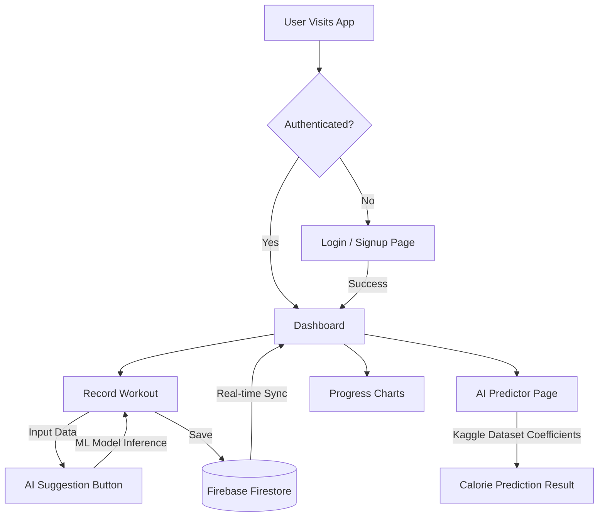

# 🏋️ MakeMeFit - AI-Powered Fitness Ecosystem

**MakeMeFit** is a premium personal fitness tracking application that combines modern UI aesthetics with high-performance data analytics and Machine Learning.

---

## 🚀 Key Features

*   **Premium Glassmorphism UI**: High-fidelity design with Dark/Light mode support.
*   **AI Calorie Predictor**: Predictive engine trained on **Kaggle's Fitness Metrics Dataset**.
*   **Real-time Synchronization**: Instant data updates across devices using **Firebase Firestore**.
*   **Dynamic Dashboard**: Visual weekly activity charts using **Recharts**.
*   **Comprehensive Logging**: Effortless tracking of exercises, sets, reps, and duration.
*   **Smart AI Planner**: A standalone tool for simulating workout results before they happen.

---

## 📊 Application Workflow



---

## 🛠️ Requirement & Dependencies

### **Frontend Implementation**
-   **React (Vite)**: Core framework for high-speed SPA performance.
-   **Tailwind CSS**: Utility-first styling for premium Glassmorphism effects.
-   **Framer Motion**: Smooth entrance and exit transitions.
-   **Lucide React**: Modern iconography system.
-   **Recharts**: Data visualization for fitness progress.
-   **React Hot Toast**: Real-time feedback for user actions.

### **Backend & Cloud**
-   **Firebase Authentication**: Secure social and email/password login.
-   **Firebase Firestore**: NoSQL real-time document storage.
-   **Firebase Hosting**: Scalable cloud production deployment.

### **Machine Learning (Kaggle Integration)**
-   **Dataset**: `aakashjoshi123/exercise-and-fitness-metrics-dataset` (Kaggle).
-   **Model**: Linear Regression trained on Python (Scikit-Learn).
-   **Integration**: PORTED mathematical coefficients directly to the React frontend for zero-latency inference.

---

## 📦 Local Setup Instructions

1. **Clone the project**
   ```bash
   git clone https://github.com/sajidtecho/MakeMeFit.git
   cd MakeMeFit
   ```

2. **Install dependencies**
   ```bash
   npm install
   ```

3. **Configure Firebase**
   -   Create a project in the [Firebase Console](https://console.firebase.google.com/).
   -   Copy your credentials into `src/services/firebase.js`.

4. **Run the development server**
   ```bash
   npm run dev
   ```

---

## 📈 ML Model Details
The underlying calorie prediction model uses a multivariate approach derived from over 3,000 Kaggle data points:
-   **Formula**: `304.148 + (Weight * 0.077) + (Duration * 0.215) + (HeartRate * -0.179) + (BMI * 0.311)`

---

## 🛡️ License
Distributed under the MIT License. See `LICENSE` for more information.

---

**Developed with ❤️ for the elite fitness community.**
